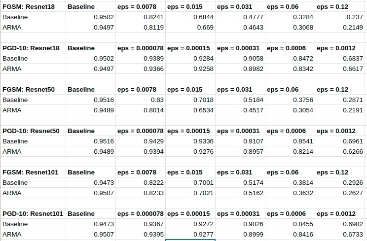

# Adversarial Robustness of ARMA Networks

---

### Authors
Arpit Aggarwal Shishira Maiya

### Introduction to the Project 
ARMA stands for Auto-regressive Moving Average, a concept that was recently introduced by a research group at UMD. The aim of adding interconnections between output neurons is to increase the net receptive field which inturn helps in learning more information from the image. This is very useful for image segmentation and object detection tasks. In this project, we compare the adversarial robustness of ARMA networks and non-ARMA networks on two gradient-based attacks, namely, FGSM and PGD-10.

### Data
The dataset used was CIFAR-10 dataset for the task of image classification(number of classes=10).

### Results

### Software Required
To run the jupyter notebooks, use Python 3. Standard libraries like Numpy and PyTorch are used.

### Credits
The following links were helpful for this project:
1. https://github.com/umd-huang-lab/ARMA-Networks
2. https://pytorch.org/tutorials/beginner/fgsm_tutorial.html
3. https://www.youtube.com/channel/UC88RC_4egFjV9jfjBHwDuvg
